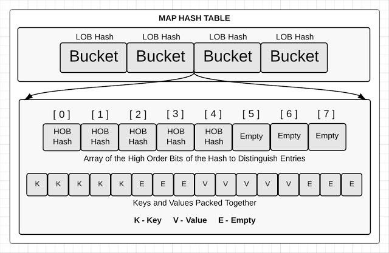

class: center, middle

# Go

---

class: center, middle

# Go?!

---

class: center, middle


---

# Team


---

class: center, middle

# Структуры данных

---

# Slice

.resize[]

```go
type slice struct {
	array unsafe.Pointer
	len   int
	cap   int
}
```

---

# Slice

.resize[]

```go
s := make([]byte, 5)
```

---

# Slice

.resize[]

```go
s[2:4]
```

---
layout: false

# String

Неизменяемый массив байт

```go
type stringStruct struct {
	str unsafe.Pointer
	len int
}
```

---

# Map

.resize[]

---

# Map

.resize[]

Когда размера бакета не хватает, выделяется новый и добавляется ссылка в старом бакете. В определённый момент, хэш таблица решит перестраиваться.

---

# Map

.resize[]

Выделяется память в два раза большего размера чем раньше. И постепенно все бакеты туда эвакуируются. При обращении к ним.

---

# Эскейп анализ

1. Go сам решает, где выделяется память
2. Определяет, выходят ли указатели на значение за функцию или нет
3. Если нет, то данные спокойно располагаются на стеке (с исключениями)
4. Данные на стеке удаляются после выхода из функции и освобождения стека все скопом.
5. Нет повода беспокоить сборщик мусора

---

# Вопросы?

<center></center>
