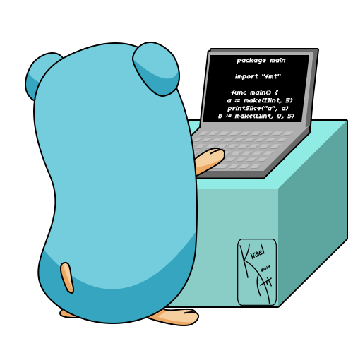

class: center, middle

# Go

<h3>Максим Дементьев &lt;<a href="mailto:max@orofarne.ru">max@orofarne.ru</a>&gt;</h3>

---

class: center, middle

# Go?!

---

class: center, middle

.resize[]

---

# Team

.resize[]

---

# Да кому он нужен?...

https://github.com/golang/go/wiki/GoUsers

---

# Плюсы и минусы Go

---

# Плюсы и минусы Go

## Простота!

---

# Чего нет

- Привычного ООП
- Дженериков
- Исключений

---

# А что есть?

- Структуры и интерфейсы
- Утиная типизация
- Горутины и каналы

---
# Hello, 世界
## [Go Tour](tour.golang.org)

```Go
package main

import "fmt"

func main() {
	fmt.Println("Hello, 世界")
}
```

---

.resize[]

---

# Function

```go
package main

import "fmt"

func swap(x, y string) (string, string) {
	return y, x
}

func main() {
	a, b := swap("hello", "world")
	fmt.Println(a, b)
}
```

---

# Struct

```go
package main

import "fmt"

type Vertex struct {
	X int
	Y int
}

func main() {
	fmt.Println(Vertex{1, 2})
}
```

---

# Slice

.resize[]

```go
type slice struct {
	array unsafe.Pointer
	len   int
	cap   int
}
```

---

# Slice

.resize[]

```go
s := make([]byte, 5)
```

---

# Slice

.resize[]

```go
s[2:4]
```

---
layout: false

# String

Неизменяемый массив байт

```go
type stringStruct struct {
	str unsafe.Pointer
	len int
}
```

---

# Map

.resize[]

---

# ООП

<center>.resize[]</center>

---

# ООП

- Области видимости
- Встраивание
- Утиная типизация

---

<center>.resize[]</center>

---

# Runtime

- Go - компилируемый язык
- Со сборщиком мусора
- С легковесными потоками - горутинами
- Со статической компиляцией

---

# Эскейп анализ

1. Go сам решает, где выделять память
2. Определяет, выходят ли указатели на значение за функцию или нет
3. Если нет, то данные спокойно располагаются на стеке (с некоторыми исключениями)
4. Данные на стеке удаляются после выхода из функции и освобождения стека все скопом.
5. Нет повода беспокоить сборщик мусора

---

# Горутины

```go
func server(i int) {
	for {
		print(i)
		time.Sleep(10)
	}
}
go server(1)
go server(2)
```

---

# Каналы

```go
package main

import "fmt"

func sum(s []int, c chan int) {
	sum := 0
	for _, v := range s {
		sum += v
	}
	c <- sum // send sum to c
}

func main() {
	s := []int{7, 2, 8, -9, 4, 0}

	c := make(chan int)
	go sum(s[:len(s)/2], c)
	go sum(s[len(s)/2:], c)
	x, y := <-c, <-c // receive from c

	fmt.Println(x, y, x+y)
}
```

---

# Cтандартная библиотека

```go
package main

import (
	"net/http"
	"fmt"
)

func SayHelloWorld(w http.ResponseWriter, r *http.Request) {
	fmt.Fprintln(w, "Hello, World!")
}

func SayHello(w http.ResponseWriter, r *http.Request) {
	fmt.Fprintln(w, "Hello!")
}

func main() {
	mux := http.NewServeMux()
	mux.HandleFunc("/", SayHelloWorld)
	mux.HandleFunc("/hello", SayHello)

	http.ListenAndServe(":8080", mux)
}
```

[http-example.go](http-example.go)

---

# Инструменты

- Go
- Go fmt
- Go get / dep
- Gogland / Atom / Sublime / Vim / etc

---

.resize[]

---

# Вопросы?

Адрес презентации:  https://orofarne.ru/p/golang-hh

.resize[]
